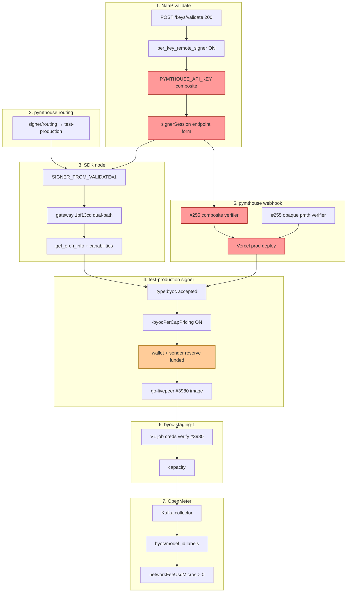

# Billed E2E Blocker Audit — naap_ → Billed Inference → OpenMeter

**Date:** 2026-07-17 (Run 47 — live probes + code review)  
**Method:** Live HTTP probes against prod/staging endpoints, `gh` PR status, gateway commit `1bf13cd` source review, gateway venv `submit_byoc_job` (certifi), Storyboard MCP regression.  
**Honesty rule:** This doc states what **failed today**, not what passed last week.

---

## Executive answer

**Is pymthouse#255 the only blocker left?** **No.**

#255 is the **primary** blocker for payment-generation identity (401 `not a JWT` at the remote-signer webhook), but it is **not sufficient alone** for first billed generation. Today’s live probes surfaced **two additional active blockers** and several **latent** ones that will appear immediately after #255 lands.

| Question | Answer |
|---|---|
| Is #255 merged/deployed? | **NO** — OPEN, `mergeStateStatus: DIRTY`, **merge conflicts** |
| Is #255 alone enough for first billed gen? | **NO** — see Section E |
| What failed today on the hot path? | Webhook auth (#255) + validate **regressed** to token-bundle (no composite endpoint) |
| Did failure mode change vs Run 46? | **YES** — validate no longer emits `{url, headers}` composite bearer; SDK error class shifted to `IncompleteRead` (truncated signer response during failed payment gen) |

---

## Section A — Current blockers (pipeline order)

### A1. NaaP validate — **PARTIAL PASS / REGRESSION**

| Probe | Result | Detail |
|---|---|---|
| `POST operator.livepeer.org/api/v1/keys/validate` + Bearer `naap_…` | **HTTP 200** | `valid: true`, `billingAccount.providerSlug: pymthouse` |
| `signerSession` shape | **REGRESSION** | **Token-bundle only:** `{ accessToken: pmth_…, tokenType, expiresIn, scope }` — **no** `{ url, headers.Authorization }` endpoint form |
| Composite `app_98575870….pmth_…` bearer | **MISSING** | Run 46 emitted composite endpoint form; Run 47 does not |
| `capabilities[]` | **EMPTY** | `[]` — `pymthouse_bpp_validate` likely OFF or M2M resolution fail-closed (non-blocking for BYOC gen) |

**Failure point:** `resolveSignerEndpoint()` is not succeeding. Code path (`keys/validate/route.ts:212-230`) fail-safes to token-bundle on any error. Most likely causes:

1. **`PYMTHOUSE_API_KEY` composite (`app_XXX.pmth_YYY`) unset** on NaaP prod Vercel — fast-path in `PymthouseAdapter.resolveSignerEndpoint()` never runs.
2. Legacy mint / `getSignerRouting()` path failing silently (caught, token-bundle kept).
3. `per_key_remote_signer` flag OFF for `livepeer-dev` (less likely — would still return token-bundle, but endpoint swap would not be attempted).

**Impact:** SDK with `SIGNER_FROM_VALIDATE=1` expects endpoint form. Token-bundle forces bare `pmth_` bearer → webhook rejects with OIDC-only verifier (see A6).

**Owner:** qiang / NaaP ops (Vercel env + per-team flags).

---

### A2. pymthouse routing — **PASS**

| Probe | Result |
|---|---|
| `GET pymthouse.com/api/v1/apps/app_98575870…/signer/routing` (M2M) | **HTTP 200** |
| `signerApiUrl` / `patterns.directDmz.signerApiUrl` | `https://pymthouse-signer-test-production.up.railway.app` |
| `webhookUrl` | `https://pymthouse.com/webhooks/remote-signer` |
| `meteringMode` | `platform_ingest` |

John A/B flip to test-production signer **still active** (unchanged from Run 45/46).

---

### A3. SDK `app.py` — **PASS (env) / FAIL (validate contract drift)**

| Item | Status | Evidence |
|---|---|---|
| `sdk.daydream.monster/health` | **PASS** | HTTP 200 |
| `/capabilities` | **PASS** | 170 caps |
| `SIGNER_FROM_VALIDATE=1` | **PASS (Run 46 SSH)** | Not re-SSH’d Run 47; no evidence of drift |
| Validate session consumption | **FAIL** | Validate returns token-bundle; hosted `naap_` inference → **502 IncompleteRead** |

**Hosted inference probe (Run 47):**

```
POST sdk.daydream.monster/inference  capability=flux-schnell  Bearer naap_…
→ HTTP 502
→ payment failed: IncompleteRead(82 bytes read, 112 more expected)
→ orch: byoc-staging-1.daydream.monster:8935
```

Historical pattern (Runs 10–16): `IncompleteRead` = signer HTTP body truncated when payment generation errors mid-flight — **symptom**, not root cause. Root cause is upstream auth/payment failure at DMZ webhook.

---

### A4. Gateway `byoc.py` (deployed `1bf13cd`) — **PASS**

| Item | Status | Evidence |
|---|---|---|
| Image on `sdk-staging-1` | **DEPLOYED** | `byoc-dual-path-1bf13cd-2026-07-16` (Run 35/46) |
| `_payment_type_for_signer()` dual-path | **IN IMAGE** | Commit `1bf13cd` is 1 commit ahead of `1114138`; adds lv2v/byoc gating |
| `get_orch_info(..., capabilities=byoc_caps)` | **YES — IN DEPLOYED IMAGE** | Present in both `1114138` and `1bf13cd` (`byoc.py` Step 1 comment + `capabilities=` kwarg) |
| Gateway PR #41 merge | **OPEN** | Not merged upstream; **does not block** — pinned image already contains the fix |

**Ticket mismatch risk after #255:** **LOW** for current canary. Per-cap `TicketParams` alignment requires `-byocPerCapPricing` ON **and** capabilities on orch discovery — gateway side is done; signer flag status unconfirmed (A5).

---

### A5. Remote signer test-production — **PARTIAL PASS / AUTH FAIL**

| Probe | test-production | old prod DMZ |
|---|---|---|
| `/healthz` | **200** | **200** |
| `/sign-orchestrator-info` + bare `pmth_` from validate | **200** | **200** |
| `type:byoc` type gate | **PASS** | **FAIL** — `invalid job type` |
| `submit_byoc_job` (gateway `1bf13cd`, bare `pmth_`) | **FAIL 401** `not a JWT` | **FAIL 400** `invalid job type` |
| `-byocPerCapPricing` | **UNKNOWN** (not externally observable) | OFF (assumed) |

**Failure point:** `/generate-live-payment` reaches pymthouse identity webhook → **401 `not a JWT`**.

Direct webhook probe with bare `pmth_`: **401 `unauthorized webhook caller`**.

---

### A6. pymthouse webhook — **FAIL (#255 NOT MERGED)**

| Item | Status | Evidence |
|---|---|---|
| [pymthouse#255](https://github.com/pymthouse/pymthouse/pull/255) | **OPEN** | `mergedAt: null` |
| Merge readiness | **BLOCKED** | `mergeable: CONFLICTING`, `mergeStateStatus: DIRTY` |
| Prod `main` webhook config | **OIDC JWT only** | `remote-signer-webhook-config.ts` on `main` — no composite/opaque verifiers |
| PR branch adds | composite `app_XXX.pmth_YYY` + opaque `pmth_*` verifiers | Files: `composite-app-api-key-verifier.ts`, `opaque-session-verifier.ts`, `first-match-verifier.ts` |
| First commit (opaque `pmth_`) on main? | **NO** | `compare/main...96b5647` → opaque verifier **not** on main |

**This is the hard stop for billed payment generation.**

---

### A7. `sign-byoc-job` / V1 job creds (#3980) — **NOT REACHED**

| Item | Status |
|---|---|
| go-livepeer [#3980](https://github.com/livepeer/go-livepeer/pull/3980) | **MERGED** 2026-07-11 |
| Live probe past payment gen | **NO** — blocked at A6 before job creds matter |

**Latent:** Will surface immediately after webhook auth passes if orch image lacks #3980 or sender reserve unfunded.

---

### A8. Orch `byoc-staging-1` — **REACHABLE / NOT THE HOT BLOCKER**

| Probe | Result |
|---|---|
| Target in SDK health | `byoc-staging-1.daydream.monster:8935` |
| Payment rejection reason | Signer-side (`IncompleteRead` / 401 class), not orch capacity 503 |
| V1 verify (#3980) | **Assumed deployed** (merged); not independently probed Run 47 |

---

### A9. OpenMeter ingest — **PASS (read) / 0 delta (gen blocked)**

| Probe | Result |
|---|---|
| `GET …/apps/app_98575870…/usage?groupBy=pipeline_model` | **HTTP 200** |
| App totals | `requestCount=286`, `networkFeeUsdMicros=599638` |
| Run 47 probe delta | **0** — no successful billed gen |

Historical per-cap ratio flux-dev / flux-schnell ≈ **4.3×** (expected **8.3×** with full per-cap pricing).

---

### A10. Storyboard MCP naap path — **UNTESTED**

| Path | Result |
|---|---|
| Daydream `list_capabilities` | **PASS** — 170 caps |
| Daydream `create_media` flux-schnell | **PASS** — 2983 ms, $0.00320 |
| `naap_` bearer through MCP NaaP provider switch | **NOT TESTED** — prod MCP env unknown |

---

## Section B — Latent blockers (surface after #255 deploys)

| # | Blocker | Why it will appear next | Owner |
|---|---|---|---|
| B1 | **Validate endpoint regression** — restore composite `{url, headers}` | Even with opaque verifier, composite bearer is the **designed** prod path (`PYMTHOUSE_API_KEY` fast-path). Token-bundle mint-per-validate is fragile | qiang / NaaP Vercel |
| B2 | **Sender reserve / wallet funding** on test-production signer for `app_98575870` | Prior runs hit `no sender reserve` / IncompleteRead when wallet unfunded | John / pymthouse ops |
| B3 | **`-byocPerCapPricing` confirmation** on test-production | Fees may stay at legacy ~4.3× ratio vs 8.3× tariff | John |
| B4 | **`sign-byoc-job` V1 verify** on orch + signer image pin | #3980 merged but image pin on test-production not verified this run | John / infra |
| B5 | **`recipientRand` / ticket param alignment** | If per-cap ON but orch/signer ticket params diverge → payment reject (not seen today — blocked earlier) | j0sh / John |
| B6 | **SDK `_validate_session_cache` stale routing** | Run 45b — manual restart needed after signer routing flips; no TTL | qiang / infra |
| B7 | **Old prod DMZ cutover** for non-A/B apps | `pymthouse-production` still rejects `type:byoc` | John |
| B8 | **Gateway #41 upstream merge** | Image pinned; drift risk on next redeploy without merge | j0sh |
| B9 | **Storyboard MCP prod env** (`STORYBOARD_PROVIDER_SWITCH`, `NAAP_*`) | NaaP key path through MCP never verified | Storyboard ops |
| B10 | **`pymthouse_bpp_validate` + capabilities[]** | Empty caps today; matters for capability gate / discovery demos, not raw BYOC SDK path | qiang |

---

## Section C — Fixed / closed (do not re-chase)

| Item | Evidence | Closed since |
|---|---|---|
| go-livepeer #3980 (`type:byoc` + V1 verify) | Merged 2026-07-11 | Run 29+ |
| Dual-path SDK image `1bf13cd` on `sdk-staging-1` | Deployed; Daydream MCP PASS | Run 35/42 |
| `SIGNER_FROM_VALIDATE=1` on VM | SSH verified Run 46 | Run 45b |
| John A/B routing → test-production signer | Validate + routing API agree | Run 45 |
| Hosted SDK signer URL drift (cache) | Restart fixed `invalid job type` → `not a JWT` | Run 45b |
| `get_orch_info` passes capabilities | In deployed `1bf13cd` source | Run 35 (this audit confirms) |
| Daydream regression | Storyboard MCP `create_media` PASS Run 47 | Run 42+ |
| OpenMeter label path + M2M read API | 286 reqs readable | Run 30+ |
| NaaP composite bearer code (#421) | Merged | 2026-07-09 |
| `type:byoc` on test-production (vs old prod) | test-prod: 401 not JWT; old prod: invalid job type | Run 45 |

---

## Section D — Minimum deploy set for John (one shot)

Everything needed before expecting **first successful billed `naap_` gen + OpenMeter delta**:

| # | Deploy / config | Repo / surface | Blocks |
|---|---|---|---|
| 1 | **Resolve merge conflicts + merge + Vercel prod deploy** [pymthouse#255](https://github.com/pymthouse/pymthouse/pull/255) | pymthouse | Webhook 401 `not a JWT` |
| 2 | **Restore NaaP validate endpoint form:** set `PYMTHOUSE_API_KEY=app_98575870….pmth_…` on NaaP prod Vercel; confirm `per_key_remote_signer` ON for `livepeer-dev` | NaaP Vercel | Composite bearer emission; SDK validate contract |
| 3 | **Confirm test-production signer image** includes go-livepeer #3980+ and `-byocPerCapPricing` ON | Railway test-production | Per-cap fees + type:byoc |
| 4 | **Fund sender reserve** for `app_98575870` wallet on test-production signer | pymthouse / on-chain | post-auth payment gen |
| 5 | **Smoke:** `submit_byoc_job` OR `sdk.daydream.monster/inference` with `naap_` → 200 + image | — | Proof |
| 6 | **OpenMeter delta:** new `byoc/flux-schnell` row with `networkFeeUsdMicros > 0` | — | Billing proof |

**Optional same window (not blocking first gen):**

- Merge gateway [#41](https://github.com/livepeer/livepeer-python-gateway/pull/41) upstream (image already pinned).
- Storyboard MCP `STORYBOARD_PROVIDER_SWITCH=1` + `NAAP_*` env.
- SDK validate-cache TTL / deploy hook to bust cache on routing flips.

---

## Section E — Honest answer: is #255 alone sufficient?

**No.**

#255 is **necessary** but **not sufficient**. Minimum chain:

```
#255 merge+deploy  →  webhook accepts bearer
       +
NaaP PYMTHOUSE_API_KEY composite  →  validate emits {url, headers} app.pmth_ bearer
       +
Funded sender reserve on test-production  →  payment gen completes (not IncompleteRead)
       +
Orch + signer on #3980 image  →  sign-byoc-job V1 verify (latent until payment passes)
```

**If John merges #255 only:**

- Bare `pmth_` from current validate **might** work IF opaque verifier from PR commit 1 is included — but validate **should** emit composite for metering attribution.
- Payment gen may still **fail** with IncompleteRead / reserve errors until wallet funded.
- Per-cap fee ratio proof (8.3×) still blocked until `-byocPerCapPricing` confirmed.

**Expected first success signature:**

1. Validate → `signerSession.url = pymthouse-signer-test-production…` + composite bearer  
2. `submit_byoc_job` or SDK inference → **200** + image URL  
3. OpenMeter → new `byoc/flux-schnell` increment  

---

## Dependency diagram



Red = **active blockers today**. Orange = **latent immediately after #255**.

---

## Run 47 probe evidence (redacted)

```text
# gh pymthouse#255
state: OPEN | mergedAt: null | mergeable: CONFLICTING | mergeStateStatus: DIRTY

# validate (Run 47)
POST operator.livepeer.org/api/v1/keys/validate + Bearer naap_8056755b… → HTTP 200
  signerSession: { accessToken: pmth_…, tokenType: Bearer }   # NO url/headers
  capabilities: []

# routing
GET pymthouse.com/.../signer/routing → test-production URL

# gateway submit_byoc_job (1bf13cd venv, bare pmth from validate)
test-production → FAIL HTTP 401 not a JWT
old prod DMZ     → FAIL HTTP 400 invalid job type

# SDK hosted
POST sdk.daydream.monster/inference flux-schnell → HTTP 502 IncompleteRead(82,112)

# Storyboard MCP (Daydream)
list_capabilities → 170 caps PASS
create_media flux-schnell → PASS 2983ms $0.00320

# OpenMeter
requestCount=286 networkFeeUsdMicros=599638 — 0 delta from probes
```

---

## Post-#424 update (2026-07-17 — John merge + live re-probe)

**Context:** John merged [NaaP #424](https://github.com/livepeer/naap/pull/424) today (~16:35Z). He reported prod NaaP is healthy, pymthouse moved to `@pymthouse/builder-sdk@0.6.0` + clearinghouse identity webhook, and platform apps should use simple `Authorization: Bearer <key>` without parsing composite keys or doing signer exchange locally.

### What #424 changed (exact diff)

| Area | Before (#421 era) | After (#424 on `main`) |
|---|---|---|
| `@pymthouse/builder-sdk` | `0.5.0` | **`0.6.0`** |
| Composite key shape | `app_<clientId>.pmth_<secret>` (dot) | **`app_<24hex>_<secret>`** (underscore) — `isCompositeApiKey()` |
| Bare `pmth_*` exchange | `POST …/auth/api-key/signer-session` | **`POST …/apps/{clientId}/oidc/token`** (RFC 8693 form body) |
| Composite fast-path | `apiKey.includes('.pmth_')` | **`isCompositeApiKey(apiKey)`** from builder-sdk |
| Identity webhook | In-SDK `@pymthouse/builder-sdk/signer/webhook` | **Removed** — use `@pymthouse/clearinghouse-identity-webhook` upstream |
| Developer-api UI | Generic success copy | Clarifies composite vs bare `pmth_*` usage |

Files touched: `pymthouse-adapter.ts`, `pymthouse-client.ts`, `pymthouse-signer-exchange-config.ts`, tests, `docs/pymthouse-integration.md`, developer-api packages.

### builder-sdk 0.6.0 — validate contract NOW

Per [builder-sdk CHANGELOG 0.6.0](https://github.com/pymthouse/builder-sdk/blob/v0.6.0/CHANGELOG.md):

- Presented composite credentials are **`app_<24hex>_<secret>`** (underscore, not dot).
- Clearinghouse identity webhook accepts them as Bearer — **NaaP/Storyboard should not parse or re-exchange them**.
- Bare `pmth_*` still exchanges via RFC 8693 token endpoint for a short-lived signer JWT + `signer_url`.

**What validate should return on prod** (when `per_key_remote_signer` ON and endpoint resolution succeeds):

```json
{
  "signerSession": {
    "url": "https://pymthouse-signer-test-production.up.railway.app",
    "headers": { "Authorization": "Bearer app_<24hex>_<secret>" }
  }
}
```

Fallback (flag OFF or `resolveSignerEndpoint` throws): token-bundle `{ accessToken: "pmth_…", tokenType, expiresIn, scope }` — SDK `SIGNER_FROM_VALIDATE=1` cannot use this for DMZ signing.

### Live probe after #424 merge (Run 48, ~11:38 PT)

| Probe | Result | Notes |
|---|---|---|
| `POST operator.livepeer.org/api/v1/keys/validate` + canonical `naap_…` | **HTTP 200** | `valid:true`, `billingAccount.providerSlug:pymthouse` |
| `signerSession` shape | **STILL token-bundle** | `{ accessToken: pmth_…, tokenType, expiresIn, scope }` — **no** `{ url, headers }` |
| `capabilities[]` | **EMPTY** | `[]` |
| `POST sdk.daydream.monster/inference` flux-schnell | **HTTP 502** | `IncompleteRead(82,112)` — same symptom as Run 47 |
| [pymthouse#255](https://github.com/pymthouse/pymthouse/pull/255) | **OPEN** | Now **`mergeable: MERGEABLE`** (was CONFLICTING Run 47) — still not merged |

**Interpretation:** #424 is on `main` but prod validate **has not yet recovered** the endpoint form. Most likely: (1) Vercel prod not redeployed with #424 yet, and/or (2) `PYMTHOUSE_API_KEY` still unset or still in **old dot format** (`app_XXX.pmth_YYY`) which **`isCompositeApiKey()` no longer recognizes**, and/or (3) `per_key_remote_signer` OFF → endpoint swap never attempted. John's "working great" likely refers to the merge + clearinghouse alignment, not first billed gen.

### Compare to our open work

| Item | Status after #424 | Action |
|---|---|---|
| **[NaaP #427](https://github.com/livepeer/naap/pull/427)** opaque-session forward | **Superseded / conflict** | #424 keeps composite + RFC 8693 paths on `main`; #427 deletes them (~340 lines) in favor of bare `pmth_` forward. **Close #427** or rebase only if John explicitly wants opaque-only path without composite env. |
| **[pymthouse#255](https://github.com/pymthouse/pymthouse/pull/255)** composite webhook | **Still needed** (likely updated format) | Clearinghouse refactor may absorb verifier logic, but webhook still returned **401 `not a JWT`** on bare `pmth_` in Run 47. #255 is mergeable again — coordinate with John on underscore composite vs legacy `app.pmth_` verifier. |
| **Validate regression** (token-bundle vs endpoint) | **NOT fixed by #424 alone** | Needs prod deploy + `PYMTHOUSE_API_KEY` in **new underscore format** + `per_key_remote_signer` ON. Old dot-format composite keys silently miss the fast-path. |
| **[NaaP #421](https://github.com/livepeer/naap/pull/421)** composite bearer | **Superseded by #424** | #421 used dot format + old exchange; #424 is the clearinghouse-aligned successor. |

### Storyboard SB-4 — what can be removed?

Grep of `livepeer/storyboard` `main` (Jul 17):

| File | Bearer / signer behavior |
|---|---|
| `lib/mcp-server/auth.ts` | Extracts `Authorization: Bearer <key>` — **no composite parsing, no exchange** |
| `lib/mcp-server/sdk-call.ts` | Forwards caller `apiKey` to SDK base — **no validate signerSession consumption** |
| `lib/sdk/provider-core.ts` | Routes `naap_` → `POST /api/v1/keys/validate` for Settings preflight only; reads `valid` flag, **ignores signerSession** |
| `lib/sdk/client.ts` | Same — mentions `signerSession` in comments only |

**Verdict:** Storyboard MCP already does the right thing for "simple Bearer auth." **No SB-4 code removal required** for composite parsing or signer exchange — that complexity lives in NaaP `resolveSignerEndpoint` + SDK `SIGNER_FROM_VALIDATE=1`, not Storyboard. Remaining Storyboard work is **ops**: `STORYBOARD_PROVIDER_SWITCH=1`, `NAAP_PROVIDER=naap`, `NAAP_BASE_URL=https://sdk.daydream.monster` once validate emits endpoint form.

### Revised action plan (post-#424)

1. **John / pymthouse:** Merge + deploy [pymthouse#255](https://github.com/pymthouse/pymthouse/pull/255) (or confirm clearinghouse identity webhook on prod accepts underscore composite + opaque `pmth_`). Fund test-production sender reserve.
2. **NaaP Vercel prod:** Redeploy from `main` (#424). Set `PYMTHOUSE_API_KEY` to a **new-format** composite `app_<24hex>_<secret>` (from Developer API / John). Confirm `per_key_remote_signer` ON for livepeer-dev.
3. **Verify:** validate → endpoint form with composite bearer → `sdk.daydream.monster/inference` 200 → OpenMeter delta.
4. **Close NaaP #427** unless team explicitly chooses opaque-forward workaround over composite env var.
5. **Storyboard prod env** (after step 3 passes): enable `STORYBOARD_PROVIDER_SWITCH` + `NAAP_*`; re-run `sb4-server-naap.test.ts`.

**Minimum chain unchanged in spirit:** webhook auth (#255/clearinghouse) + validate endpoint form (env + flag + #424 deploy) + funded signer → first billed gen.

---

## Related docs

- `BILLED-E2E-REMAINING-PLAN.md` — pillar plan (Run 35–46 era)
- `USER-E2E-DEMO-RESULTS.md` — Run 45/46 detailed probes
- `BPP-VALIDATE-V2-NAAP-DISCOVERY.md` — validate/discovery contract
- `SIGNER-ORCH-DEPLOY-PLAN.md` — signer-side deploy targets
