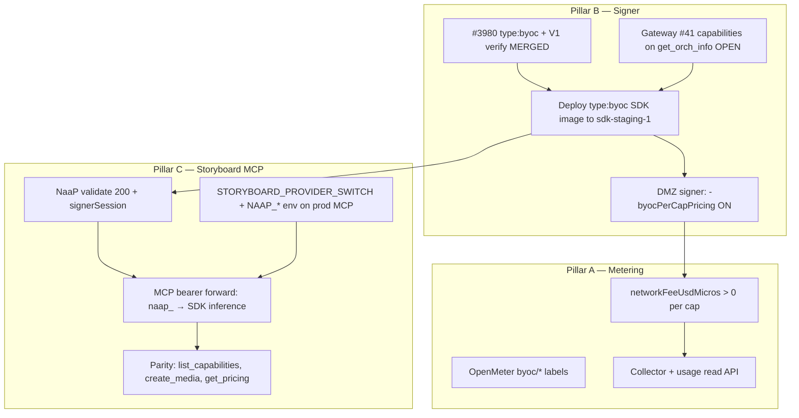

# Billed E2E — Remaining Work Plan

**Date:** 2026-07-16 (refreshed after Run 35 dual-path deploy)  
**Scope:** Close the loop on three demo goals — pymthouse metering, remote signer tickets, Storyboard MCP parity with Daydream keys.  
**Honesty rule:** Status below reflects **live Run 35 deploy + verification**, not aspirational checklists.

---

## Executive summary

| Pillar | Headline status | Immediate blocker |
|---|---|---|
| **A — pymthouse metering** | Labels **DONE**; per-cap fees **PARTIAL** (non-zero but ratios suspect) | DMZ `-byocPerCapPricing` not confirmed ON; fee math ~4.3× schnell→dev vs expected ~8.3× |
| **B — remote signer tickets** | go-livepeer **#3980 MERGED**; gateway **#41 OPEN** (+ dual-path fix `1bf13cd` **DEPLOYED**); Daydream regression **FIXED** on shared node | `sdk-staging-1` on `byoc-dual-path-1bf13cd-2026-07-16`; `/health` + `/capabilities` (170 caps) **PASS** |
| **C — Storyboard MCP + NaaP key** | SB-4 **code MERGED** (#490); prod wiring **NOT VERIFIED** this run | `NAAP_KEY` unavailable → validate/inference/MCP naap path **SKIP**; prod front door globally OFF (404 without livepeer-dev key) |

---

## Dependency order



| Step | Blocks | Owner |
|---|---|---|
| Merge gateway #41 | Correct TicketParams when per-cap pricing ON | `j0sh` (code owner) |
| Redeploy `sdk-staging-1` with type:byoc image + `SIGNER_FROM_VALIDATE=1` | Hosted naap_ inference, Storyboard MCP gen path | qiang / infra |
| Enable `-byocPerCapPricing` on pymthouse DMZ signer | Non-zero, correctly-ratioed per-cap fees | John (pymthouse ops) |
| Supply / mint livepeer-dev `naap_` key for E2E | All validate + inference + MCP parity tests | qiang (admin) |
| Prod Storyboard MCP env (`STORYBOARD_PROVIDER_SWITCH=1`, `NAAP_PROVIDER=naap`, `NAAP_BASE_URL`) | Server-side NaaP routing without browser | Storyboard ops |

---

## Pillar A — pymthouse metering correctly

### Goal

OpenMeter rows under `pipeline=byoc`, `model_id=<cap>` with **non-zero** `networkFeeUsdMicros` that reflect per-cap USD tariffs (flux-dev ≈ 8.3× flux-schnell when pricing is correct).

### Current status (Run 34)

| Item | Status | Evidence |
|---|---|---|
| OpenMeter labels `byoc/<cap>` | **DONE** | Builder API M2M `app_98575870` / `m2m_5ad45661…`: `byoc/flux-schnell`, `byoc/flux-dev`, `byoc/nano-banana` present |
| `networkFeeUsdMicros` > 0 on BYOC image caps | **PARTIAL** | `byoc/flux-schnell` 645 µUSD / 34 reqs ≈ **19 µUSD/req**; `byoc/flux-dev` 326 / 4 ≈ **81.5 µUSD/req**; `byoc/nano-banana` 323 µUSD/req |
| Per-cap fee **ratio** (dev vs schnell) | **SUSPECT** | Observed ~4.3×; expected ~8.3× if full per-cap pricing aligned |
| `-byocPerCapPricing` flag on DMZ signer | **UNKNOWN** | Not observable from outside; fee pattern suggests partial or legacy pricing path |
| Collector / Kafka ingest | **ASSUMED OK** | pymthouse read path faithful (Run 32); totals `requestCount=261`, `networkFeeUsdMicros=462977` |
| Usage read API (`groupBy=pipeline_model`) | **DONE** | `GET …/apps/app_98575870…/usage?groupBy=pipeline_model&include=retail` → 200 |
| `app_98575870` wiring | **DONE** | M2M auth works; same app used across Runs 13–34 |

### Gaps

1. **Confirm and enable `-byocPerCapPricing`** on the Railway DMZ signer (go-livepeer #3967 / #3972 territory).
2. **Re-smoke after flag ON** — one gen per cap → verify fee ratio flux-dev / flux-schnell ≈ 8.3.
3. **NaaP `usage_ingest` dashboard path** — optional; Builder API M2M is sufficient for demo proof today.

### PRs / commits

| Repo | PR / item | State |
|---|---|---|
| go-livepeer | [#3980](https://github.com/livepeer/go-livepeer/pull/3980) type:byoc + V1 verify | **MERGED** 2026-07-11 |
| go-livepeer | [#3972](https://github.com/livepeer/go-livepeer/pull/3972) per-cap pricing + labels | **OPEN** |
| pymthouse | Collector label path (`ConstrainedPipelineModelID`) | **DONE** (labels correct since Run 30) |

### Verification steps

1. `GET pymthouse.com/api/v1/apps/app_98575870…/usage?groupBy=pipeline_model` — assert `pipeline=byoc` + correct `modelId`.
2. Run 1× `flux-schnell`, 1× `flux-dev` via hosted SDK with `naap_` key → re-query usage; assert new row fees > 0 and ratio ≈ 8.3.
3. Optional: compare `ownerChargeUsdMicros` vs `networkFeeUsdMicros` (should mirror).

**Owner:** John (DMZ signer flag + pricing); qiang (E2E smoke + OpenMeter read).

---

## Pillar B — remote signer signing tickets correctly

### Goal

`type:"byoc"` payments accepted; V1 job creds verify; TicketParams aligned with per-cap `CapabilitiesPrices`; DMZ stable (no IncompleteRead/401); `SIGNER_FROM_VALIDATE=1` on SDK node.

### Current status (Run 34)

| Item | Status | Evidence |
|---|---|---|
| `type:byoc` acceptance (#3980) | **MERGED** | go-livepeer #3980 merged 2026-07-11 |
| V1 job creds verify (#3980) | **MERGED** | Same PR |
| TicketParams + capabilities on `get_orch_info` | **CODE DONE, NOT DEPLOYED** | Gateway #41 commit `1114138`; PR **OPEN**, blocked on `j0sh` |
| DMZ stability (IncompleteRead/401) | **NOT RE-TESTED** | No `NAAP_KEY` → no validate → no signer auth this run |
| `SIGNER_FROM_VALIDATE=1` on sdk-staging-1 | **DONE** | VM `/opt/sdk/.env` + `sdk-service` container env (verified post-redeploy) |
| `AUTH_VALIDATE_URL` | **DONE** | `https://operator.livepeer.org/api/v1/keys/validate` |
| SDK image on sdk-staging-1 | **DONE** | `sdk-service:byoc-dual-path-1bf13cd-2026-07-16` @ gateway `1bf13cd` (PR #41 dual-path); `_payment_type_for_signer()` confirmed in container; digest `sha256:f0ae3c5b…` |
| `sdk.daydream.monster` health | **DONE** | `/health` 200; `/capabilities` 200 (170 caps incl. flux-schnell, flux-dev) |
| NaaP composite bearer (#421) | **MERGED** | `app.pmth_` emission merged 2026-07-09 |

### Gaps

1. **Merge gateway #41** — capabilities on orch discovery (Run 33 fix `1114138`); build + push `1114138` image when merged.
2. ~~**Dual-path SDK image**~~ — **DONE (Run 35)** — `byoc-dual-path-1bf13cd-2026-07-16` deployed; Daydream (`signer.daydream.live`) gets `type:lv2v`, pymthouse DMZ gets `type:byoc`.
3. **John: enable `-byocPerCapPricing`** on DMZ signer after #41 is live (TicketParams alignment prerequisite).
4. **Re-run DMZ stability** — validate → signerSession → hosted `/inference` × 3 caps; watch for 401 / IncompleteRead.

### PRs / commits

| Repo | PR | State |
|---|---|---|
| go-livepeer | [#3980](https://github.com/livepeer/go-livepeer/pull/3980) | **MERGED** |
| livepeer-python-gateway | [#41](https://github.com/livepeer/livepeer-python-gateway/pull/41) @ `1114138` | **OPEN** — `j0sh` review |
| simple-infra | [#85](https://github.com/livepeer/simple-infra/pull/85) sdk.naap-front-door overlay | **MERGED** |
| NaaP | [#421](https://github.com/livepeer/naap/pull/421) composite bearer | **MERGED** |

### Verification steps

1. `POST operator.livepeer.org/api/v1/keys/validate` (Bearer `naap_…`) → 200, `signerSession.url` + composite `Authorization`.
2. `POST sdk.daydream.monster/inference` (flux-schnell, flux-dev, nano-banana) → 200 + image.
3. `scripts/byoc-e2e-probe.py` with `NAAP_KEY` set → `submit_byoc_job: PASS`.
4. OpenMeter: new gens under `byoc/<cap>` with fees > 0.

**Owner:** `j0sh` (#41 merge); qiang (redeploy); John (DMZ signer image + flags).

### Dual-path deploy — Daydream + NaaP on one SDK node (Run 35 audit)

`sdk.daydream.monster` (`sdk-staging-1`) serves **both** Daydream keys (`pmth_` / `sk_`) and NaaP keys (`naap_`). Signer routing and payment type are **independent** layers:

| Layer | Daydream key (`pmth_` / `sk_`) | NaaP key (`naap_`) |
|---|---|---|
| **Signer selection** (`app.py` `_effective_signer`) | `SIGNER_FROM_VALIDATE=1` is **inert** — `_resolve_validate_session` returns `None` for non-`naap_` tokens → static `SIGNER_URL` = `https://signer.daydream.live` + caller `Authorization` forwarded | Validate → `signerSession.url` = pymthouse DMZ + composite `app.pmth_` bearer |
| **Payment payload** (`byoc.py` `_create_byoc_payment`) | **Same image for all callers** — PR #41 commit `4e5870e` sends `type:"byoc"` + capabilities proto **unconditionally** | Same `type:"byoc"` — **works** on pymthouse DMZ post go-livepeer #3980 |

**Confirmed:** `type:byoc` breaks **only** requests that hit the **legacy Daydream signer**, not all signers. `SIGNER_FROM_VALIDATE=1` does **not** force Daydream traffic through pymthouse; it only switches signer for `naap_` keys.

**Root cause of Daydream breakage:** Run 34 redeployed gateway `4e5870e` (unconditional `type:byoc`) onto the shared staging node while `SIGNER_URL` remains `signer.daydream.live`. Daydream MCP / Storyboard tools pass a Daydream bearer → SDK uses legacy signer → gateway posts `type:byoc` → legacy signer rejects (expects `type:lv2v` + string `capability`).

**Image comparison:**

| Image tag | Gateway commit | Payment shape | Daydream on `signer.daydream.live` | `naap_` on pymthouse DMZ |
|---|---|---|---|---|
| `byoc-lv2v-bd8e7807-2026-07-09` | `bd8e7807` | `type:lv2v` + `capability` string | **WORKS** (Run 18–29) | **WORKS** (DMZ accepts lv2v post-#3980; labels stay `unknown`) |
| `byoc-type-byoc-4e5870e-2026-07-10` | `4e5870e` (PR #41) | `type:byoc` + capabilities proto | **BREAKS** | **WORKS** (Run 29 hosted 3/3 with `SIGNER_FROM_VALIDATE=1`) |

**Safe redeploy (ops, today):**

```bash
# Keep NaaP validate wiring; roll back gateway payment shape only.
export SDK_IMAGE="us-docker.pkg.dev/livepeer-simple-infra/simple-infra/sdk-service:byoc-lv2v-bd8e7807-2026-07-09"
./scripts/deploy-byoc.sh --env staging \
  --sdk-values environments/staging/sdk.naap-front-door.values.yaml
# Overlay sets AUTH_VALIDATE_URL + SIGNER_FROM_VALIDATE=1 only — does NOT change SIGNER_URL.
```

**Safe redeploy (code, target):** Extend gateway #41 with **signer-aware payment type** in `_create_byoc_payment`:

- `signer.daydream.live` (or static `SIGNER_URL` host) → `type:lv2v` + `capability` string (today's Daydream contract).
- pymthouse DMZ (`pymthouse-production.up.railway.app` or validate `signerSession.url`) → `type:byoc` + capabilities proto + capabilities on `get_orch_info` (`1114138`).

**Fix status (Run 35):** **DEPLOYED** — gateway commit `1bf13cd` on PR [#41](https://github.com/livepeer/livepeer-python-gateway/pull/41) adds `_payment_type_for_signer()` and gates payment payload on signer host. Image `byoc-dual-path-1bf13cd-2026-07-16` live on `sdk-staging-1` / `sdk.daydream.monster` (Cloud Build `09b14b06`, digest `sha256:f0ae3c5b3eb180148cbbbb43c60d01c99cbfba493e2dfd3fdde446ea3fb997bd`). Verified: `/health` 200, `/capabilities` 200 (170 caps), container grep confirms dual-path code, `SIGNER_FROM_VALIDATE=1`, `ADAPTER_URLS=http://…` (not https).

Optional env `BYOC_PAYMENT_TYPE=auto|lv2v|byoc` (`auto` = detect from `signer_url` host) for canary without a second image.

**Overlay config (`sdk.naap-front-door.values.yaml`) is correct as-is** — it enables the NaaP path without touching Daydream signer selection. Do **not** remove `SIGNER_FROM_VALIDATE=1`; fix the gateway image or pin `byoc-lv2v-bd8e7807` until dual-path lands.

**Live VM state (verified Run 35 post-deploy):** `/opt/sdk/.env` — `SIGNER_URL=https://signer.daydream.live`, `AUTH_VALIDATE_URL=…/keys/validate`, `SIGNER_FROM_VALIDATE=1`, `ADAPTER_URLS=http://8.229.77.130:9090,http://8.229.27.185:9090`, `SDK_IMAGE=…byoc-dual-path-1bf13cd-2026-07-16`; container gateway confirms `_payment_type_for_signer()` at byoc.py:151.

---

## Pillar C — Storyboard MCP + NaaP key parity with Daydream key

### Goal

Storyboard MCP tools (`list_capabilities`, `create_media`, `get_pricing`, etc.) work identically whether the caller presents a **Daydream** key (`pmth_` / `sk_`) or a **NaaP** key (`naap_`), when `STORYBOARD_PROVIDER_SWITCH=1` and NaaP connector is wired.

### Current status

| Item | Status | Evidence |
|---|---|---|
| SB-4 server implementation | **DONE** | storyboard #490 merged 2026-06-19; `provider-server.ts`, `sdk-call.ts` |
| NaaP sdk connector (#392) | **DONE** | NaaP #392 merged; `GET /api/v1/gw/sdk/capabilities` → 401 without key (route live) |
| Validate path / composite bearer | **CODE DONE** | NaaP #421 merged; **not live-tested Run 34** (no key) |
| `STORYBOARD_PROVIDER_SWITCH` on prod MCP | **UNKNOWN** | Prod Storyboard Vercel env not inspected; default OFF → Daydream byte-for-byte |
| MCP bearer forward | **DESIGNED** | MCP extracts `Authorization` from request → `sdkCall({ apiKey })` → SDK base from `resolveServerServiceUrl()` |
| **Daydream key today** | **WORKS** (baseline) | MCP docs: all tools metered against bearer Daydream key; `sdk.daydream.monster` healthy, 170 caps |
| **naap_ key today** | **NOT VERIFIED** | Run 34 SKIP; prior runs: validate 200 when livepeer-dev key + front door ON; hosted inference flaky (401/IncompleteRead) |

### Capability parity matrix (expected vs observed)

| MCP tool | Daydream key (`pmth_` / demo bearer) | `naap_` key (SB-4 + NaaP path) | Gap |
|---|---|---|---|
| `list_capabilities` | **WORKS** — SDK `/capabilities` 200, 170 caps | **UNTESTED** — needs validate + SDK route via `NAAP_BASE_URL` or gateway | Prod MCP likely still points at `sdk.daydream.monster` (flag OFF) |
| `get_pricing` | **WORKS** | **UNTESTED** | Same routing gap |
| `create_media` | **WORKS** (when SDK/signer healthy) | **BLOCKED** in prior runs by signer/DMZ instability | Redeploy + DMZ fix |
| `generate_project` | **WORKS** | **UNTESTED** | — |
| SB-4 e2e (`sb4-server-naap.test.ts`) | N/A | **PASS on preview** (4/4, June 2026 report) | Prod not re-run |

### Gaps for full parity

1. **Prod Storyboard MCP env:** `STORYBOARD_PROVIDER_SWITCH=1`, `NAAP_PROVIDER=naap`, `NAAP_BASE_URL=https://sdk.daydream.monster` (or NaaP gateway `…/api/v1/gw/sdk`), `NAAP_AUTH_VALIDATE_URL=https://operator.livepeer.org/api/v1/keys/validate`.
2. **NaaP front door** must return 200 for livepeer-dev `naap_` keys (per-team override ON — globally OFF returns 404, confirmed Run 34).
3. **Hosted SDK** must run type:byoc image (#41) so inference succeeds with naap_ bearer.
4. **MCP integration test:** `POST storyboard…/api/mcp` with `Authorization: Bearer naap_…` → `list_capabilities` + `create_media` (flux-schnell).
5. **Optional:** NaaP Service Gateway path (`/api/v1/gw/sdk/*`) for AVAIL gate per `sb4-server-naap.test.ts` — requires `sdk_connector` ON + valid `naap_` key.

### PRs / commits

| Repo | PR | State |
|---|---|---|
| storyboard | [#490](https://github.com/livepeer/storyboard/pull/490) SB-4 | **MERGED** |
| NaaP | [#392](https://github.com/livepeer/naap/pull/392) sdk connector | **MERGED** |
| NaaP | [#421](https://github.com/livepeer/naap/pull/421) composite bearer | **MERGED** |

### Verification steps

1. `STORYBOARD_PROVIDER_SWITCH=1 NAAP_PROVIDER=naap NAAP_BASE_URL=… NAAP_API_KEY=naap_… npx vitest run tests/e2e/sb4-server-naap.test.ts`
2. MCP: `tools/list` → `list_capabilities` with naap_ bearer → non-empty caps.
3. MCP: `create_media` flux-schnell → image URL returned; OpenMeter `byoc/flux-schnell` increments.
4. Control: same calls with Daydream key → identical tool surface (INV-1 when flag OFF).

**Owner:** Storyboard ops (prod env); qiang (E2E with naap_ key); blocked on Pillars A+B for billed `create_media`.

---

## Run 34 immediate blockers (action list)

| # | Blocker | Severity | Next action |
|---|---|---|---|
| 1 | **`NAAP_KEY` not available** in env / `/tmp/rawkey` | **HIGH** | Mint or hand over livepeer-dev `naap_` key for validate + inference + MCP tests |
| 2 | ~~**type:byoc image breaks Daydream on shared node**~~ | **RESOLVED** | Dual-path image `byoc-dual-path-1bf13cd-2026-07-16` deployed Run 35; Daydream path restored |
| 3 | **Gateway #41 not merged** | **HIGH** | `j0sh` approval → merge → rebuild SDK image |
| 4 | **Per-cap pricing ratio suspect** | **MEDIUM** | John enables `-byocPerCapPricing`; re-smoke + OpenMeter ratio check |
| 5 | **Prod validate 404 without key** | **LOW (expected)** | Front door globally OFF; livepeer-dev per-team override required — not a regression if key-based tests pass |
| 6 | **Storyboard prod MCP NaaP env** | **MEDIUM** | Confirm/set `STORYBOARD_PROVIDER_SWITCH` + `NAAP_*` on Vercel |

---

## Related docs

- `USER-E2E-DEMO-RESULTS.md` — Run 34 appended below Run 33
- `SIGNER-ORCH-DEPLOY-PLAN.md` — signer-side combine/deploy detail (#3966/#3967)
- `SIMPLE-INFRA-CANARY-DEPLOY-PLAN.md` — canary SDK node + `NAAP_BASE_URL` wiring
- `BPP-VALIDATE-V2-NAAP-DISCOVERY.md` — NaaP validate front door contract
- `storyboard-a3/SB-4-PLAN.md`, `SDK-GATEWAY-PLAN.md` — Storyboard provider switch design
