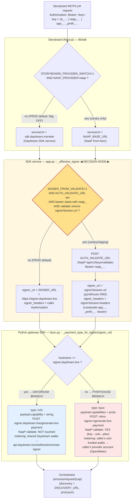

# Storyboard Signer Routing — Daydream vs pymthouse (Production)

_Read-only investigation. How Storyboard (production) decides whether a
generation request uses the **Daydream signer** (`signer.daydream.live`,
`type:lv2v`) or the **pymthouse per-key signer** (DMZ, `type:byoc`, composite
`app_…_pmth_…` bearer, NaaP validate)._

---

## TL;DR — the one-paragraph answer

The SDK (livepeer-python-gateway) is **not** the authoritative decision-maker,
and neither is Storyboard. The real switch lives in the **SDK service**
(`sdk.daydream.monster`, code `simple-infra/sdk-service-build/app.py`) in the
function `_effective_signer`, gated by the server env flag
**`SIGNER_FROM_VALIDATE`** (plus `AUTH_VALIDATE_URL` being set). A request only
takes the pymthouse path when **all** of these hold at once: `SIGNER_FROM_VALIDATE=1`,
`AUTH_VALIDATE_URL` is set, the presented bearer is a **`naap_` key**, and NaaP's
`/api/v1/keys/validate` returns an **endpoint-form `signerSession` (`{url, headers}`)**.
Otherwise the service falls back to the static `SIGNER_URL = https://signer.daydream.live`
(the Daydream signer). The python-gateway SDK only performs a *derived* second
step: `_payment_type_for_signer(signer_url)` maps the chosen signer **hostname**
to a payment shape — `signer.daydream.live → type:lv2v`, anything else →
`type:byoc`. **In PRODUCTION today `SIGNER_FROM_VALIDATE` and `AUTH_VALIDATE_URL`
are unset**, so every request goes to the Daydream signer / `type:lv2v`; the
pymthouse per-key path is currently enabled only on the **canary/staging**
overlays. So the API-key format matters only as an *input* to the SDK service's
env-gated decision — it is not itself the switch.

---

## Was the user's assumption right? (SDK decides?)

**Partially, but mislocated.** There are three layers, and the *authoritative*
choice is the middle one, not the SDK library:

| Layer | What it decides | Where | Is it the real switch? |
|-------|-----------------|-------|------------------------|
| Storyboard (Next.js) | Which SDK **service base URL** to call (Daydream `sdk.daydream.monster` vs a NaaP front door) | `lib/sdk/provider-server.ts`, `lib/mcp-server/sdk-call.ts` | No — prod flag OFF ⇒ always Daydream service |
| **SDK service** (`app.py`) | Which **signer URL** (static Daydream vs per-key pymthouse DMZ) | `simple-infra/sdk-service-build/app.py` `_effective_signer` | **YES — this is the decision node** |
| SDK library (python gateway) | Payment **type** derived from the signer hostname (`lv2v` vs `byoc`) | `livepeer-python-gateway/.../byoc.py` `_payment_type_for_signer` | No — purely derived from the URL it was handed |

The SDK library's `_payment_type_for_signer` looks like "the SDK decides," but it
is only translating a signer URL that was already chosen upstream by the SDK
service's env-gated `_effective_signer`.

---

## Architecture diagram (production decision flow)

---

## Prose walk-through of each hop

### 1. Storyboard → SDK service base URL (NOT the signer switch)
Storyboard forwards the caller's `Authorization: Bearer <key>` unchanged and only
chooses **which SDK service to call**. The decision is the server flag
`STORYBOARD_PROVIDER_SWITCH` (default OFF) + `NAAP_PROVIDER` (`daydream`|`naap`).
With the flag OFF — **today's production** — it resolves to the Daydream SDK base
(`STORYBOARD_SDK_URL`/`SDK_URL`, default `https://sdk.daydream.monster`)
byte-for-byte (INV-1). The NaaP-front-door branch is a documented **config-only,
canary** rollout, not prod-live.

- `lib/sdk/provider-core.ts:28` — `DEFAULT_PROVIDER_ID = "daydream"`.
- `lib/sdk/provider-core.ts:52-71` — provider registry (daydream base `sdk.daydream.monster`; naap base is operator-supplied).
- `lib/sdk/provider-core.ts:186-198` — `resolveServiceUrlFrom` returns the Daydream fallback unless switch ON + `naap` + valid base.
- `lib/sdk/provider-server.ts:65-68` — `isServerProviderSwitchEnabled()` reads `STORYBOARD_PROVIDER_SWITCH` (default OFF).
- `lib/sdk/provider-server.ts:81-97` — `loadServerProviderInput()` returns a dormant Daydream input when the flag is OFF.
- `lib/mcp-server/sdk-call.ts:259-265` — the MCP path uses `resolveServerServiceUrl()`; only logs/degrades when actually routed to NaaP.

### 2. SDK service → which signer URL  ◀ THE DECISION NODE ▶
Inside the SDK service, `_effective_signer` picks the signer. Default (prod): the
static `SIGNER_URL`. It diverts to a per-key pymthouse DMZ signer **only** when
`SIGNER_FROM_VALIDATE` is on, `AUTH_VALIDATE_URL` is set, the bearer is a `naap_`
key, and the NaaP validate response carries an endpoint-form `signerSession`.

- `simple-infra/sdk-service-build/app.py:519` — `SIGNER_URL = os.environ.get("SIGNER_URL", "")`.
- `simple-infra/sdk-service-build/app.py:540` — `AUTH_VALIDATE_URL = os.environ.get("AUTH_VALIDATE_URL", "").strip()`.
- `simple-infra/sdk-service-build/app.py:541` — `SIGNER_FROM_VALIDATE = … in ("1","true")`.
- `simple-infra/sdk-service-build/app.py:1001-1068` — `_resolve_validate_session`: POSTs `naap_` key to `AUTH_VALIDATE_URL`, reads `signerSession.{url,headers}` (endpoint form only).
- `simple-infra/sdk-service-build/app.py:1072-1091` — `_effective_signer`: **the branch**. Returns `(SIGNER_URL, caller-headers)` by default; returns `(signerSession.url, signerSession.headers)` when a per-key session resolved.
- `simple-infra/sdk-service-build/app.py:986-991` — `_extract_signer_headers`: forwards the caller `Authorization` header to the signer (this is how the composite `app_…_pmth_…` bearer reaches the DMZ signer).
- `simple-infra/sdk-service-build/app.py:2179-2180` — the inference dispatch uses `signer_url_eff = _current_signer_url.get() or (SIGNER_URL or None)`.

### 3. Python gateway SDK → payment type (derived from the signer hostname)
The gateway maps the signer host to a payment shape. This is the code that *looks*
like "the SDK decides," but it only reacts to the URL handed to it.

- `livepeer-python-gateway/src/livepeer_gateway/byoc.py:148` — `_LEGACY_DAYDREAM_SIGNER_HOST = "signer.daydream.live"`.
- `livepeer-python-gateway/src/livepeer_gateway/byoc.py:151-161` — `_payment_type_for_signer`: `signer.daydream.live → "lv2v"`, else `"byoc"`.
- `livepeer-python-gateway/src/livepeer_gateway/byoc.py:193-230` — `_create_byoc_payment`: `lv2v` sends `payload.capability` (string); `byoc` sends `payload.capabilities` (proto). Both POST `{signer}/generate-live-payment`.
- `livepeer-python-gateway/src/livepeer_gateway/lv2v.py:350-358` — the pure LV2V entrypoint `start_lv2v` hard-codes `type="lv2v"` (used by the live-video path).

### 4. Composite bearer `app_…_pmth_…` (pymthouse side)
The composite bearer is a pymthouse concept (public client id + secret), parsed
by the DMZ signer / pymthouse, **not** by the SDK library. The SDK service simply
forwards whatever `Authorization` header it holds (`_extract_signer_headers`, or
the `signerSession.headers` NaaP returns).

- `pymthouse/src/lib/signer/composite-app-api-key-bearer.ts:10-29` — parses `app_<publicClientId>.pmth_<secret>`.
- `pymthouse/src/app/api/v1/auth/validate/route.ts` — the NaaP/pymthouse `/api/v1/keys/validate` front door (gated by `BPP_VALIDATE_V2`), which returns the `signerSession` the SDK service consumes.

### 5. Metering destinations
- **Daydream branch:** signed with the **shared** signer wallet; billing webhook →
  `https://api.daydream.live/webhooks/remote-signer`
  (`simple-infra/environments/shared/signers.yaml:29-31`, `:54-63`).
- **pymthouse branch:** signed with the **caller's own funded wallet**
  (`signerSession`), so usage is metered to the caller's provider account via
  NaaP/OpenMeter (`signers.yaml:54-60`; `docs/per-key-remote-signer-sdk-service-spec.md`).

---

## Current PRODUCTION state (evidence)

Production is the **Daydream signer / `type:lv2v`** path. The pymthouse per-key
path is **off** in prod and enabled only on canary/staging.

| Setting | Production | Canary / staging (NaaP front door) |
|---------|-----------|------------------------------------|
| `SIGNER_URL` | `https://signer.daydream.live` | `https://signer.daydream.live` (static fallback) |
| `AUTH_VALIDATE_URL` | *(unset)* | `https://operator.livepeer.org/api/v1/keys/validate` |
| `SIGNER_FROM_VALIDATE` | *(unset → OFF)* | `1` |
| `DISCOVERY_URL` | `…/discovery/production.json` | staging/per-key |
| `STORYBOARD_PROVIDER_SWITCH` | *(OFF, default)* | `1` (canary) |
| Effective signer | **Daydream (`signer.daydream.live`, lv2v)** | **pymthouse DMZ (per-key, byoc)** |

Citations:
- Prod SDK-service env: `simple-infra/environments/production/byoc.values.yaml:34-41`
  (`SIGNER_URL: https://signer.daydream.live`, no `AUTH_VALIDATE_URL`, no `SIGNER_FROM_VALIDATE`).
- Canary enablement: `simple-infra/environments/canary/byoc.canary.values.yaml:8-10`
  (`AUTH_VALIDATE_URL: …operator.livepeer.org/api/v1/keys/validate`, `SIGNER_FROM_VALIDATE: "1"`).
- Staging front-door overlay: `simple-infra/environments/staging/sdk.naap-front-door.values.yaml:16-17`.
- Default compose values: `simple-infra/docker-compose/sdk-service.yaml:10,16,38`
  (`SIGNER_URL` defaults to `signer.daydream.live`; `AUTH_VALIDATE_URL`/`SIGNER_FROM_VALIDATE` default empty).
- Guard rail: `simple-infra/scripts/validate-envs.sh:141-155` — `SIGNER_FROM_VALIDATE=1`
  is rejected unless `AUTH_VALIDATE_URL` is also set.
- Prod discovery/signer shared identity: `simple-infra/environments/production/fleet.yaml:5-18`.

> Note: production env is inferred from the deploy configs in `simple-infra`
> (the live prod env vars were not read directly). The prod `byoc.values.yaml`
> header also notes production BYOC was `status: planned` as of 2026-04-14; the
> live Storyboard generation path in prod runs against the Daydream SDK service
> (`sdk.daydream.monster`) with the static `signer.daydream.live` signer.

---

## Summary of decision fields

| Question | Field / env | Where it lives |
|----------|-------------|----------------|
| Which SDK service? | `STORYBOARD_PROVIDER_SWITCH` + `NAAP_PROVIDER` | Storyboard (server env) |
| **Which signer URL?** | **`SIGNER_FROM_VALIDATE` + `AUTH_VALIDATE_URL` + `naap_` key + validate `signerSession`** | **SDK service `app.py` `_effective_signer`** |
| Which payment type? | signer **hostname** (`signer.daydream.live`?) | SDK library `byoc.py` `_payment_type_for_signer` |
