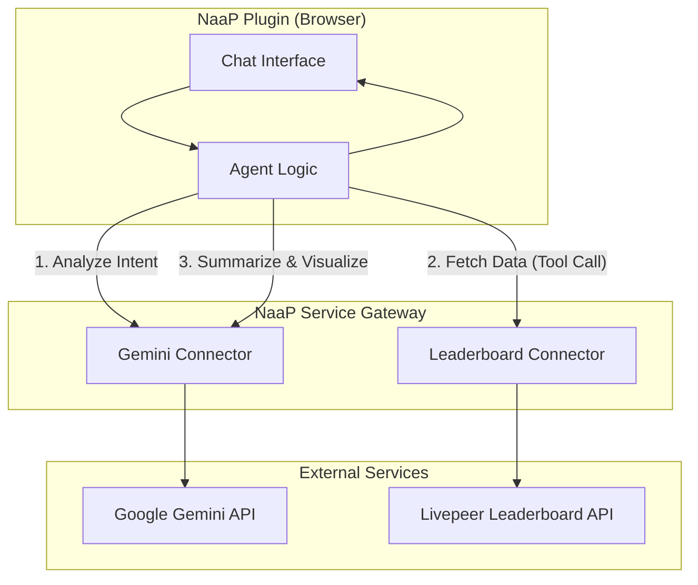

# Tutorial: Building an Intelligent Analytics Agent

In this advanced tutorial, we will build a sophisticated **Intelligent Analytics Plugin** that combines multiple external services via the **Service Gateway**. 

The application will allow users to ask natural language questions about the Livepeer network (e.g., *"Who is the fastest orchestrator for FLUX image generation?"*). An LLM agent (powered by **Gemini**) will analyze the intent, call the **Livepeer AI Leaderboard API** to fetch real-time data, and then present the results as an interactive analytics experience.

---

## 1. Architecture: Multi-Connector Orchestration

By using the Service Gateway, we avoid building a complex backend for agent orchestration. The logic resides in the frontend, while the Gateway handles security and connectivity.



---

## 2. Step-by-Step Implementation

### Step 1: Provision the Connectors
Ensure both connectors are registered in the Service Gateway.

1.  **Gemini Connector** (`gemini`): Provides LLM capabilities.
2.  **Leaderboard Connector** (`livepeer-leaderboard`): Provides network performance data.

*Note: Use the provided seed scripts `bin/seed-public-connectors.ts` and `bin/seed-leaderboard-gateway.ts` to provision these quickly in development.*

### Step 2: Define Agent Tools
The agent needs to know how to fetch data. We define the Leaderboard API as a "tool" that Gemini can call.

```typescript
const LEADERBOARD_TOOL = {
  name: "get_orchestrator_stats",
  description: "Get performance statistics for orchestrators on the Livepeer AI network.",
  parameters: {
    type: "object",
    properties: {
      pipeline: { type: "string", description: "e.g., text-to-image, image-to-video" },
      model: { type: "string", description: "The AI model name" }
    },
    required: ["pipeline", "model"]
  }
};
```

### Step 3: Implement the Intelligent Loop
The core of the plugin is a loop that handles the conversation and tool execution.

```typescript
// examples/intelligent-analytics/frontend/src/lib/agent.ts

async function runAgent(userPrompt: string) {
  // 1. Send prompt to Gemini via Gateway
  const response = await fetch('/api/v1/gw/gemini/chat', {
    method: 'POST',
    body: JSON.stringify({
      contents: [{ role: 'user', parts: [{ text: userPrompt }] }],
      tools: [{ function_declarations: [LEADERBOARD_TOOL] }]
    })
  });

  const msg = await response.json();
  const toolCall = msg.candidates[0].content.parts.find(p => p.functionCall);

  if (toolCall) {
    // 2. Execute tool via Leaderboard Connector
    const { pipeline, model } = toolCall.functionCall.args;
    const stats = await fetch(`/api/v1/gw/livepeer-leaderboard/stats?pipeline=${pipeline}&model=${model}`);
    const data = await stats.json();

    // 3. Send data back to Gemini for final summary
    return await summarizeWithGemini(userPrompt, data);
  }

  return msg.candidates[0].content.parts[0].text;
}
```

### Step 4: Build Interactive Visualizations
Instead of just text, use the structured data returned by the Leaderboard API to render charts.

```tsx
// Rendered based on tool output
{agentData && (
  <div className="grid grid-cols-1 md:grid-cols-2 gap-4">
    <LatencyBarChart data={agentData.orchestrators} />
    <SuccessRateGauge rate={agentData.overallSuccessRate} />
  </div>
)}
```

---

## 3. Why This Pattern Wins

### 1. Effort Saving
Traditionally, building an "AI Agent" requires a Python backend (LangChain/FastAPI) to securely manage keys and orchestrate calls. Here, the **Service Gateway replaces the entire backend layer**:
*   **Gemini API Key?** Managed by Gateway.
*   **Leaderboard Auth?** Managed by Gateway.
*   **CORS?** Handled by same-origin shell routing.

### 2. Cleaner Architecture
The plugin is a pure React application. It treats the Gateway connectors as high-level "Internal APIs". This makes the code easier to test, debug, and port.

### 3. Multi-Service Synergy
You can easily add more connectors (e.g., **Slack** to notify teams of performance drops, or **Postgres** to log agent history) without changing the plugin's infrastructure. The Gateway provides a unified fabric for all external integrations.

---

## Conclusion

By combining the **Gemini** and **Livepeer Leaderboard** connectors, we've built a complex, "intelligent" application with minimal code. This pattern allows NaaP developers to focus on **UX and Agent Logic** rather than the plumbing of API security and proxying.

**Next Steps:**
- [Explore the Gemini Connector Config](../apps/web-next/src/app/api/v1/gw/admin/usage/by-connector/route.ts)
- [Check out the Leaderboard Plugin Example](../examples/leaderboard/README.md)
