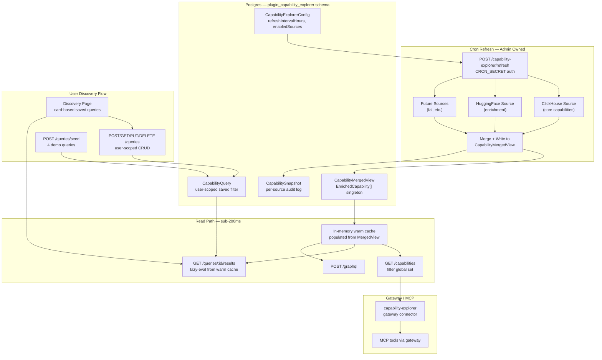

# Capability Explorer — Architecture & Developer Guide

## Overview

The Capability Explorer is a **core plugin** that discovers, enriches, and exposes Livepeer network AI capabilities. It combines data from ClickHouse (live network state) and HuggingFace (model metadata) into a single, cached dataset that users can query through the UI, REST API, GraphQL, or the Service Gateway.

## Architecture Diagram



## Data Flow

### Refresh Cycle (every 4 hours by default)

1. **Vercel Cron** triggers `POST /api/v1/capability-explorer/refresh` with CRON_SECRET
2. **Refresh engine** checks `CapabilityExplorerConfig.refreshIntervalHours` to decide if refresh is due
3. **Core sources** (ClickHouse) fetch live network capabilities (GPU counts, pricing, latency)
4. **Enrichment sources** (HuggingFace) add model descriptions, thumbnails, licenses, tags
5. **Merge** combines core + enrichment into `EnrichedCapability[]`
6. **Persist** writes the merged result to `CapabilityMergedView` (singleton row) and logs each source's result in `CapabilitySnapshot`
7. **Config update** sets `lastRefreshAt` and `lastRefreshStatus`

### Read Path (sub-200ms)

1. User request hits any capability endpoint (list, detail, GraphQL, query results)
2. **Aggregator** checks the 60-second in-memory warm cache
3. On cache miss, reads `CapabilityMergedView` from Postgres (~50ms)
4. Populates warm cache and runs filters in-memory (<10ms)
5. Returns filtered results — **never touches ClickHouse or HuggingFace**

## Database Models

All models use the `plugin_capability_explorer` Postgres schema:

| Model | Purpose |
|-------|---------|
| `CapabilityMergedView` | Singleton row with the complete merged dataset (capabilities, stats, categories) |
| `CapabilitySnapshot` | Per-source audit log of each refresh cycle |
| `CapabilityExplorerConfig` | Admin config (refresh interval, enabled sources) |
| `CapabilityQuery` | User-scoped saved filters (like DiscoveryPlan in orchestrator-leaderboard) |

## Extensible Data Source Interface

```typescript
interface CapabilityDataSource {
  readonly id: string;
  readonly name: string;
  readonly type: 'core' | 'enrichment';
  fetch(ctx: SourceContext): Promise<SourceResult>;
}
```

### Adding a New Source

1. Create `sources/your-source.ts` implementing `CapabilityDataSource`
2. Register it in `sources/index.ts` with `registerSource(new YourSource())`
3. Toggle it via the admin API: `PATCH /admin/config` with `{ enabledSources: { "your-source": true } }`

Built-in sources:
- **clickhouse** (core) — fetches from `semantic.network_capabilities` and `semantic.gateway_latency_summary`
- **huggingface** (enrichment) — fetches model cards for description, thumbnail, license, tags

## API Endpoints

### Public (auth required)

| Method | Path | Description |
|--------|------|-------------|
| GET | `/capabilities` | List/filter capabilities |
| GET | `/capabilities/:id` | Get capability detail |
| GET | `/capabilities/:id/models` | Get models for a capability |
| GET | `/categories` | List categories with counts |
| GET | `/stats` | Aggregated statistics |
| GET | `/filters` | Available filter values |
| POST | `/graphql` | GraphQL endpoint |

### Discovery Queries (user-scoped)

| Method | Path | Description |
|--------|------|-------------|
| GET | `/queries` | List user's saved queries |
| POST | `/queries` | Create a new query |
| GET | `/queries/:id` | Get a specific query |
| PUT | `/queries/:id` | Update a query |
| DELETE | `/queries/:id` | Delete a query |
| GET | `/queries/:id/results` | Evaluate query (stable endpoint) |
| POST | `/queries/seed` | Seed 4 demo queries |

### Admin

| Method | Path | Description |
|--------|------|-------------|
| GET | `/admin/config` | Current configuration |
| PATCH | `/admin/config` | Update refresh interval / toggle sources |
| POST | `/admin/refresh` | Manual refresh trigger |
| GET | `/admin/sources` | List registered sources with status |
| GET | `/admin/snapshots` | Recent snapshot history |

### Cron

| Method | Path | Description |
|--------|------|-------------|
| POST | `/refresh` | Cron-triggered refresh (CRON_SECRET auth) |

All paths are prefixed with `/api/v1/capability-explorer/`.

## User Discovery Queries

The Discovery feature mirrors the **DiscoveryPlan** pattern from the orchestrator-leaderboard:

1. User creates a **CapabilityQuery** with filter criteria (category, search, GPU count, price, etc.)
2. The query is saved to Postgres, scoped to the user's team and user ID
3. The query gets a **stable endpoint**: `GET /queries/:id/results`
4. User polls this endpoint — no need to pass filter parameters each call
5. Results are evaluated against the warm cache (sub-200ms)

## Frontend

The plugin frontend uses a **MemoryRouter** with two tabs:

- **Explorer** — Portfolio-like grid of all capabilities with search, filter, and sort
- **Discovery** — Card-based UI for saved queries with endpoint guides

## Vercel Deployment

- **Cron**: `vercel.json` registers `/api/v1/capability-explorer/refresh` at `0 */4 * * *`
- **Schema**: `prisma db push` in the build pipeline creates tables automatically
- **Seed data**: `bin/seed-capability-explorer.ts` runs during build (step 3.7) to ensure preview deployments have demo data
- **Preview branches**: Seed data provides 5 demo capabilities and 4 demo queries

## Gateway / MCP Integration

The `capability-explorer` gateway connector (`plugins/service-gateway/connectors/capability-explorer.json`) exposes the plugin's endpoints through the Service Gateway:

- Self-referential upstream (`${NEXT_PUBLIC_APP_URL}`)
- Endpoints: `capabilities`, `capability`, `categories`, `stats`, `graphql`, `query-results`
- Each endpoint has `cacheTtl` for gateway-level caching
- Automatically becomes MCP tools via `mcp-adapter.ts`: `capability_explorer__capabilities`, etc.
