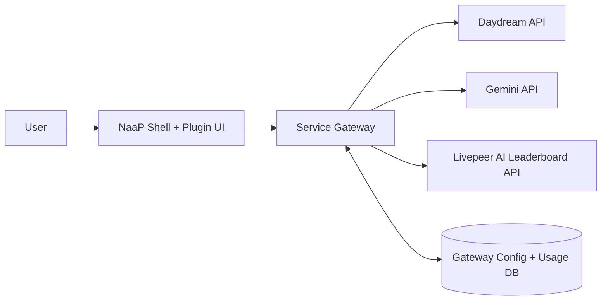
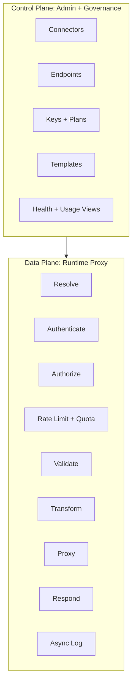
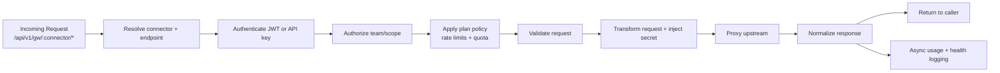
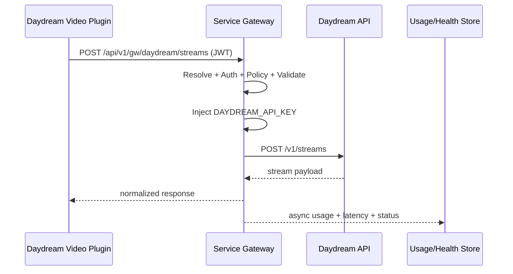
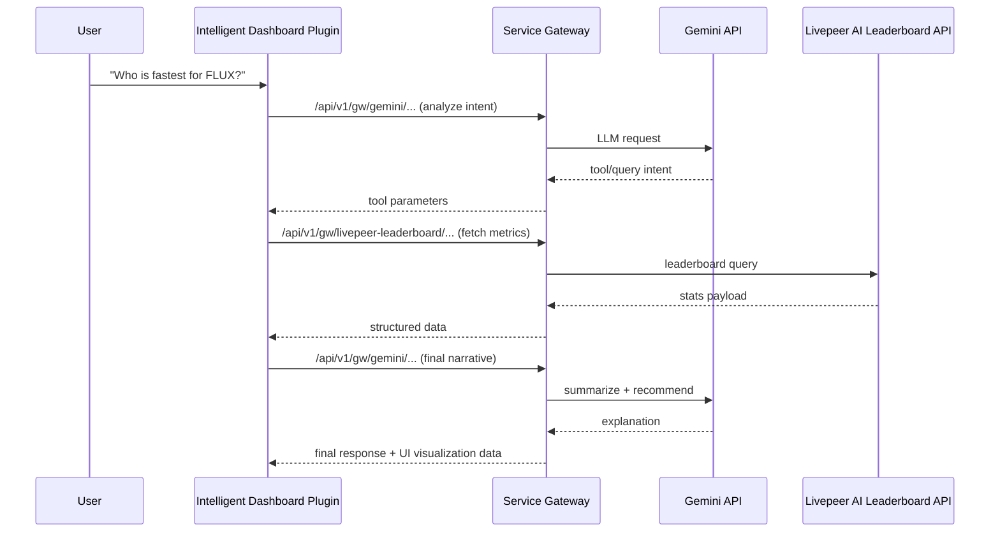

# Service Gateway Plugin

Zero-code serverless API gateway for NaaP. Expose any REST API as a managed, secure, team-scoped endpoint with authentication, rate limiting, usage tracking, health checks, and templates.

## Why this plugin exists

Without a shared gateway, every plugin team has to build and maintain:
- custom proxy routes
- secret management
- auth + access policy logic
- retries/timeouts/error normalization
- usage telemetry and dashboards

Service Gateway centralizes those responsibilities once and exposes a stable integration surface:
- Runtime data plane: `/api/v1/gw/:connector/*`
- Admin control plane: `/api/v1/gw/admin/*`

---

## Key features

- **Zero-code connectors**: configure external APIs in UI/API, no bespoke backend required.
- **Dual-path auth**: NaaP JWT for first-party plugin traffic, API keys for external clients.
- **Team isolation**: all connectors/keys/plans/usage scoped by team.
- **Policy enforcement**: rate limits and quotas using assignable plans.
- **Security by default**: server-side secret injection + SSRF protections.
- **Operational observability**: usage, latency, errors, and health history out of the box.
- **Streaming support**: SSE/LLM-style passthrough where configured.
- **Templates**: prebuilt connector blueprints for Daydream, AI/LLM, ClickHouse, and more.

---

## Architecture (how it works)

### System context



### Control plane vs data plane



### Runtime request pipeline



---

## Example 1: Daydream video integration

### Connector model
- Connector id: `daydream`
- Upstream base URL: `https://api.daydream.live`
- Typical mapped routes:
  - `POST /streams` -> `POST /v1/streams`
  - `PATCH /streams/:id` -> `PATCH /v1/streams/:id`
  - `GET /streams/:id` -> `GET /v1/streams/:id`

### Request flow diagram



### Practical impact
- No Daydream key in frontend.
- No plugin-specific proxy server to maintain.
- Built-in production telemetry from first request.

---

## Example 2: Intelligent analytics with Gemini + AI Leaderboard

This pattern powers an agentic dashboard where LLM reasoning and network metrics are composed through one gateway.

### Connectors
- `gemini`: intent parsing, reasoning, summarization.
- `livepeer-leaderboard`: orchestrator/model performance data.

### Orchestration diagram



### Practical impact
- Multi-service agent flow without creating a separate orchestration backend.
- Shared security and policy for both connectors.
- Faster UX iteration on prompts/tools/visualization.

---

## DevX and speed-to-delivery benefits

### 1) Faster initial build
- New integration is mostly config: connector + endpoint + secret + plan.
- Teams start shipping feature UX immediately instead of backend plumbing.

### 2) Lower ongoing maintenance
- One gateway implementation for retries, limits, auth, and telemetry.
- Fewer duplicated bugs and less cross-plugin drift.

### 3) Production readiness by default
- Rate limits, quotas, and key rotation are first-class.
- Health checks and usage analytics are built in from day one.

### 4) Strong security posture
- Secrets stay server-side.
- Standardized policy path reduces accidental insecure patterns.

### 5) Better cross-team leverage
- Platform improvements in gateway immediately benefit every plugin.
- Consistent architecture improves onboarding and delivery velocity.

---

## Quick start

### 1) Create a connector (Admin UI)

Open **Service Gateway** in the NaaP sidebar, then click **+ New Connector**.

### 2) Create from template (API)

```bash
curl -X POST /api/v1/gw/admin/templates \
  -H "Authorization: Bearer YOUR_JWT" \
  -H "x-team-id: YOUR_TEAM_ID" \
  -H "Content-Type: application/json" \
  -d '{"templateId": "daydream", "upstreamBaseUrl": "https://api.daydream.live"}'
```

### 3) Create API key

```bash
curl -X POST /api/v1/gw/admin/keys \
  -H "Authorization: Bearer YOUR_JWT" \
  -H "x-team-id: YOUR_TEAM_ID" \
  -H "Content-Type: application/json" \
  -d '{"name": "my-app", "connectorId": "CONNECTOR_ID"}'
```

### 4) Call gateway runtime

```bash
curl -X POST /api/v1/gw/daydream/streams \
  -H "Authorization: Bearer gw_YOUR_API_KEY" \
  -H "Content-Type: application/json" \
  -d '{"pipeline":"streamdiffusion","params":{"prompt":"neon anime"}}'
```

---

## API reference

### Gateway runtime

| Method | Path | Description |
|--------|------|-------------|
| ANY | `/api/v1/gw/:connector/:path` | Proxy request to configured upstream |

### Admin APIs

| Method | Path | Description |
|--------|------|-------------|
| GET | `/api/v1/gw/admin/connectors` | List connectors |
| POST | `/api/v1/gw/admin/connectors` | Create connector |
| GET | `/api/v1/gw/admin/connectors/:id` | Get connector detail |
| PUT | `/api/v1/gw/admin/connectors/:id` | Update connector |
| DELETE | `/api/v1/gw/admin/connectors/:id` | Archive connector |
| POST | `/api/v1/gw/admin/connectors/:id/test` | Test connectivity |
| POST | `/api/v1/gw/admin/connectors/:id/publish` | Publish connector |
| GET/POST | `/api/v1/gw/admin/connectors/:id/endpoints` | Manage endpoints |
| GET/POST | `/api/v1/gw/admin/keys` | Manage API keys |
| POST | `/api/v1/gw/admin/keys/:id/rotate` | Rotate key |
| GET/POST | `/api/v1/gw/admin/plans` | Manage plans |
| GET | `/api/v1/gw/admin/usage/summary` | Usage summary |
| GET | `/api/v1/gw/admin/usage/timeseries` | Usage time series |
| GET | `/api/v1/gw/admin/health` | Health overview |
| POST | `/api/v1/gw/admin/health/check` | Trigger health check |
| GET/POST | `/api/v1/gw/admin/templates` | Connector templates |

---

## Templates

| Template | Auth | Endpoints | Use case |
|----------|------|-----------|----------|
| AI / LLM | Bearer token | Chat, completions, embeddings, models | OpenAI/Anthropic/local LLM |
| ClickHouse | Basic auth | Query, tables, schema | Analytics queries |
| Daydream | Bearer token | Create/Get/Update/Stop stream | AI video generation |

---

## Data model

All models live in `plugin_service_gateway` PostgreSQL schema:
- `ServiceConnector`: upstream service config (team-scoped)
- `ConnectorEndpoint`: route definitions per connector
- `GatewayApiKey`: consumer API keys (SHA-256 hashed)
- `GatewayPlan`: rate limit and quota tiers
- `GatewayUsageRecord`: per-request usage telemetry
- `GatewayHealthCheck`: upstream health history

---

## Production readiness checklist

- Connector host allowlist configured.
- Endpoint validation/transformation rules verified.
- Key rotation policy in place.
- Plans and limits tested under load.
- Usage and error dashboards reviewed.
- Health checks enabled and monitored.
- Degraded/failure UX handled in the consuming plugin.

---

## Troubleshooting

### Upstream returns 403

Verify connector secrets and auth mapping in connector settings.

### Frequent 429 responses

Review assigned plan limits and request burst patterns.

### Health status stays down

Validate upstream URL/health path and run connector test flow.

### Connector returns 404

Confirm connector is published (not draft) and route mapping exists.

---

## File structure

```
plugins/service-gateway/
├── plugin.json
├── README.md
├── templates/
│   ├── ai-llm.json
│   ├── clickhouse.json
│   └── daydream.json
├── database/
│   └── README.md
└── frontend/
    ├── package.json
    ├── vite.config.ts
    └── src/
        ├── App.tsx
        ├── mount.tsx
        ├── hooks/
        │   └── useGatewayApi.ts
        ├── components/
        │   ├── TeamGuard.tsx
        │   ├── SecretField.tsx
        │   └── QuickStart.tsx
        └── pages/
            ├── ConnectorListPage.tsx
            ├── ConnectorWizardPage.tsx
            ├── ConnectorDetailPage.tsx
            ├── ApiKeysPage.tsx
            ├── PlansPage.tsx
            └── DashboardPage.tsx
```
