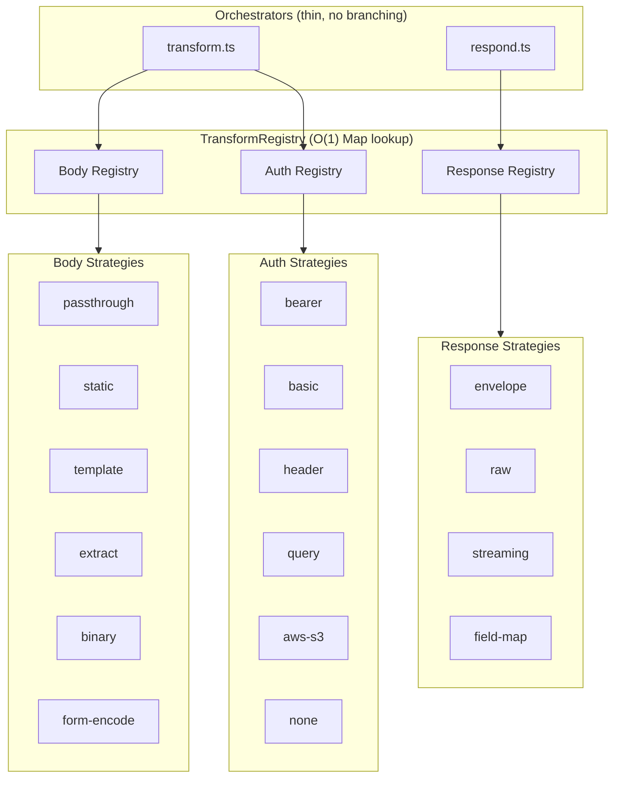

# Transform Layer Architecture

## Overview

The Service Gateway transform layer converts consumer requests into upstream-compatible requests and upstream responses into consumer-compatible responses. It follows a **Strategy + Registry** pattern to satisfy all five SOLID principles.

---

## Design: Strategy + Registry

All transformation behavior is implemented as **strategy objects** that implement a shared interface. Strategies are registered by name in a global **TransformRegistry** singleton at application startup. At runtime, the orchestrator files (`transform.ts`, `respond.ts`) look up the correct strategy by name from the registry instead of branching via switch statements.



---

## Request Pipeline


1. **URL construction** (`buildUpstreamUrl`): combines base URL + endpoint path, replaces `:param` and `:param*` placeholders, forwards/overrides query params. This step is not strategy-dispatched because all connectors use the same URL-building logic.

2. **Header building** (`buildUpstreamHeaders`): sets content-type, applies `headerMapping` with `{{secrets.*}}` interpolation, forwards observability headers.

3. **Body transform** (registry-dispatched): the `bodyTransform` field on the endpoint record selects the strategy.

4. **Auth injection** (registry-dispatched): the `authType` field on the connector record selects the strategy. Auth runs after body/URL are finalized because AWS S3 signing needs the final URL and payload hash.

---

## Response Pipeline


1. **Mode resolution** (`resolveResponseMode`): checks `streamingEnabled` + content-type for SSE, then `responseWrapper` for envelope vs raw.

2. **Strategy dispatch** (registry-dispatched): the resolved mode name selects the response strategy.

---

## SOLID Principle Mapping

| Principle | How it is satisfied |
|-----------|-------------------|
| **S** (Single Responsibility) | Each strategy file handles exactly one transform type or auth type. Orchestrators handle only dispatch. |
| **O** (Open/Closed) | Adding a new transform = new file + register. Zero edits to orchestrators. |
| **L** (Liskov Substitution) | Any `BodyTransformStrategy` can replace any other without breaking the orchestrator contract. |
| **I** (Interface Segregation) | Strategies receive narrow context types (`BodyTransformContext`, `AuthContext`, `ResponseTransformContext`), not the full `ResolvedConfig`. |
| **D** (Dependency Inversion) | Orchestrators depend on the `TransformRegistry` interface, not concrete strategy imports. Concrete dependencies (e.g., `aws-sig-v4.ts`) live only inside their strategy file. |

---

## File Structure

```
apps/web-next/src/lib/gateway/
├── transform.ts              # Request orchestrator (URL + headers + registry dispatch)
├── respond.ts                # Response orchestrator (mode resolution + registry dispatch)
├── proxy.ts                  # Upstream HTTP fetch (unchanged)
├── transforms/
│   ├── types.ts              # Strategy interfaces + context types + shared utilities
│   ├── registry.ts           # TransformRegistry singleton
│   ├── index.ts              # Bootstrap — registers all default strategies
│   ├── body/
│   │   ├── passthrough.ts    # Forward body as-is
│   │   ├── static.ts         # Use upstreamStaticBody
│   │   ├── template.ts       # Interpolate {{body.field}} placeholders
│   │   ├── extract.ts        # Extract nested field from JSON
│   │   ├── binary.ts         # Forward ArrayBuffer unchanged
│   │   └── form-encode.ts    # JSON → application/x-www-form-urlencoded
│   ├── auth/
│   │   ├── bearer.ts         # Authorization: Bearer {token}
│   │   ├── basic.ts          # Authorization: Basic {base64}
│   │   ├── header.ts         # Custom headers with secret interpolation
│   │   ├── query.ts          # Secret as URL query parameter
│   │   ├── aws-s3.ts         # AWS Signature V4 signing
│   │   └── none.ts           # No authentication
│   └── response/
│       ├── shared.ts         # Header stripping + safe header builder
│       ├── envelope.ts       # NaaP {success, data, meta} envelope
│       ├── raw.ts            # Passthrough without wrapping
│       ├── streaming.ts      # SSE passthrough with gateway headers
│       └── field-map.ts      # Response field restructuring
```

---

## Performance

- Registry lookup is O(1) via `Map.get()`.
- Strategy objects are plain singletons — no instantiation overhead per request.
- The bootstrap module (`transforms/index.ts`) runs once on first import.
- No measurable runtime difference from the pre-refactor switch-based approach.

---

## Extension Points

1. **New body transform**: implement `BodyTransformStrategy`, register in `transforms/index.ts`.
2. **New auth type**: implement `AuthStrategy`, register in `transforms/index.ts`.
3. **New response mode**: implement `ResponseTransformStrategy`, register in `transforms/index.ts`.
4. **Custom per-connector logic**: configure via endpoint/connector database fields — no code-level customization needed for most cases.
